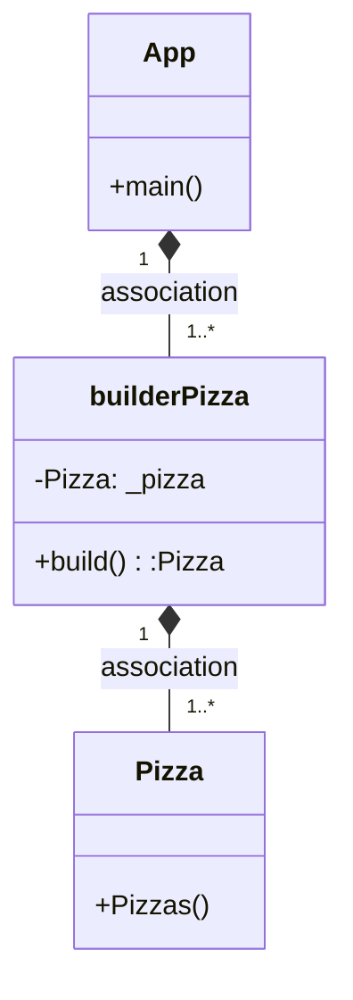
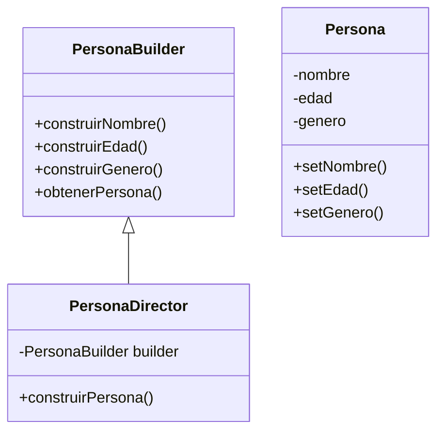

# Diagrama

---

# **EXAMEN COD**

---

# - ¿Cuál es la función del PatronBuilder?

El patrón Builder es un patrón de diseño creacional que se utiliza para crear objetos complejos paso a paso y de manera flexible, separando la creación de objetos de su representación. Permite un control detallado sobre el proceso de construcción mediante la definición de una interfaz abstracta que define los métodos para construir cada parte del objeto complejo. Además, proporciona una solución para la creación de objetos con múltiples opciones y configuraciones al permitir la creación de un solo constructor que acepta diferentes parámetros de configuración para construir objetos con diferentes opciones y características.   

Un ejemplo común de PatronBuilder, es la creación de una persona. La persona tiene diferentes atributos, como nombre, edad y género.

# -¿Cómo es su Diagrama de clases de este ejemplo que has hecho? Realiza en el readme el diagrama

# -¿Podríamos combinarlo con el PatronFactory? Explícalo con algo de código como lo harías

Si que se puede combinar con el PatronFactory.

        // Clase abstracta para Persona
    public abstract class Persona {
        protected String nombre;
        protected int edad;
        protected String genero;

        // Métodos getters y setters para las propiedades de Persona
        }

// Clase concreta de Persona

    public class Estudiante extends Persona {
        // Propiedades y métodos específicos para Estudiante
        }

        // Clase Factory para Persona
    public class PersonaFactory {
        public static Persona crearPersona(String tipo) {
        if (tipo.equals("estudiante")) {
        return new Estudiante();
        } else if (tipo.equals("profesor")) {
    return new Profesor();
    } else {
        return null;
            }
        }
    }   

// Clase Builder para Persona

    public class PersonaBuilder {
            private Persona persona;
            public PersonaBuilder() {
            persona = PersonaFactory.crearPersona("estudiante");
        }
    public PersonaBuilder construirNombre(String nombre) {
        persona.setNombre(nombre);
        return this;
    }

    public PersonaBuilder construirEdad(int edad) {
    persona.setEdad(edad);
    return this;
    }

    public PersonaBuilder construirGenero(String genero) {
        persona.setGenero(genero);
        return this;
    }

    public Persona obtenerPersona() {
    return persona;
        }
    }
